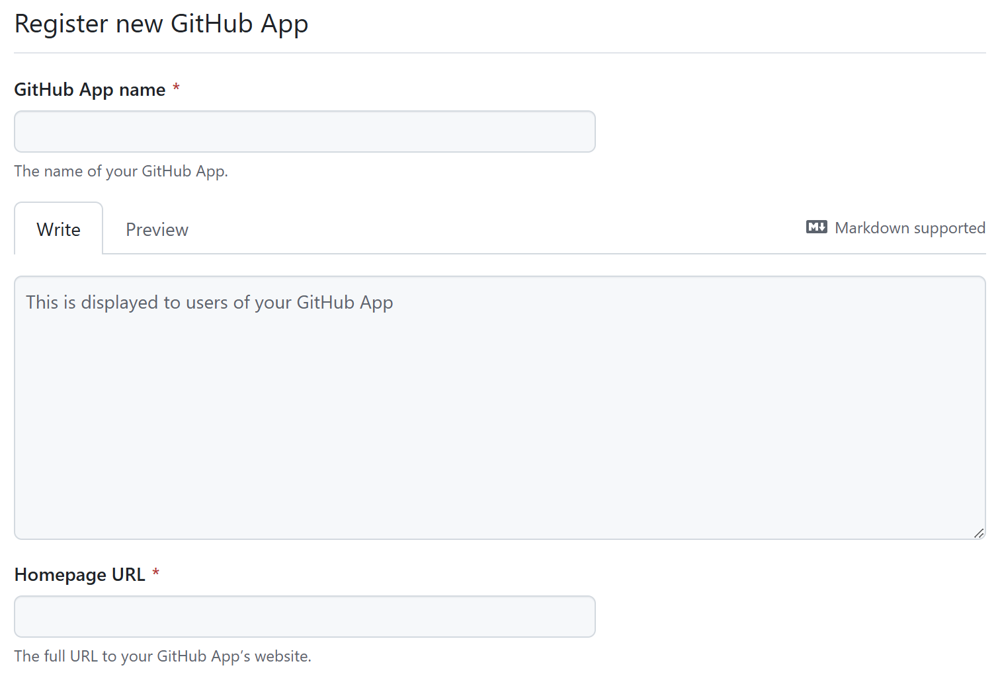
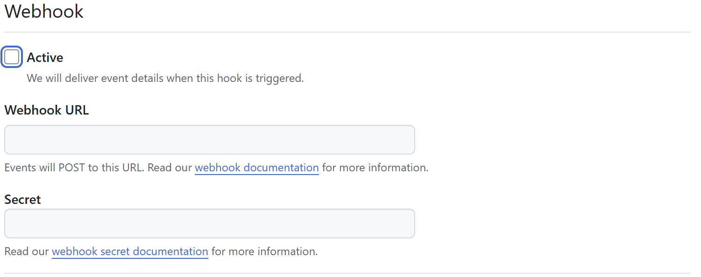
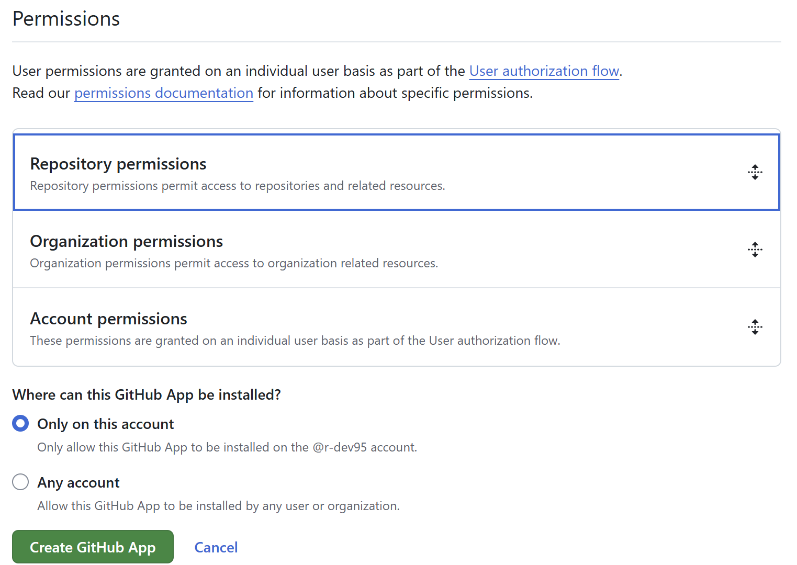

<!-- ============================================================
  Project Image
 ============================================================ -->
<div align=center>
  
  &nbsp;&nbsp;&nbsp;&nbsp;&nbsp;
  
  &nbsp;&nbsp;&nbsp;&nbsp;&nbsp;
  
  
</div>

<!-- ============================================================
  Overview
 ============================================================ -->

# :book:Overview

<!-- [](./README.md) -->
[](./README.md)
[](./LICENSE)
[](https://zenn.dev/)
[](https://qiita.com/)

[](https://github.com/nodejs/node)
[](https://github.com/microsoft/TypeScript)

本リポジトリでは、`Zenn`と`Qiita`の記事を相互に同期するための Github Actions を提供します。

本アクションを使用すれば、一方のプラットフォームの記事からもう一方のプラットフォームの記事を自動で生成できます。

以降、同期元を`Zenn`、同期先を`Qiita`とする場合、`Zenn` -> `Qiita`と記述します。
逆の場合、`Qiita` -> `Zenn`と記述します。

<!-- ============================================================
  Features
 ============================================================ -->

## :desktop_computer:Features

本アクションの主な機能を示します。

### 差分検知

`git diff`を用いて、同期元リポジトリの前回と今回のプッシュの差分を取得し、変更のあったファイル（追加・更新・削除）のみを処理対象とします。

### 双方向のフォーマット変換（[詳細](#双方向のフォーマット変換について)）

`Zenn` -> `Qiita`または`Qiita` -> `Zenn`の双方向にマークダウンのフォーマットを変換します。

- メタデータの変換: プラットフォーム独自のfront matterを変換します。
- コンテンツの変換: プラットフォーム独自のマークダウン記法を変換します。

### 同期先ファイルの削除

同期元のファイルが削除された場合、同期先のファイルも削除します。

### リポジトリへのコミット&プッシュ

生成したファイルを同期先リポジトリへコミット&プッシュします。

### ユーザ設定（[詳細](#ユーザ設定について)）

コンフィグファイルによって、ユーザごとに変更可能な設定があります。

<!-- ============================================================
  Getting Started
 ============================================================ -->

## :rocket:Getting Started

<div align=center>
  
</div>

ここでは、`Zenn` -> `Qiita`の想定で説明します。

`Qiita` -> `Zenn`の場合、読み替えてください。

また`Zenn` -> `Qiita`、`Qiita` -> `Zenn`の両方設定することも可能です。

### `Zenn`と`Qiita`のリポジトリを作成

`Zenn`と`Qiita`の記事を管理するリポジトリをそれぞれ作成してください。

また下記、設定をそれぞれ行ってください。

- `Zenn`:

  - [Zenn CLI のインストール][zenn-cli]
  - [Zenn と Github の連携][zenn-github]

- `Qiita`:

  - [Qiita CLI のインストール][qiita-cli]
  - リポジトリにプッシュした際、`public`ディレクトリも反映されるようにファイルを置いてください。(例えば、`.keep`ファイル)

`Zenn`、`Qiita`ともにリポジトリにプッシュするだけで投稿できるため、投稿の機能は公式の方法を用います。

[zenn-cli]: https://zenn.dev/zenn/articles/install-zenn-cli
[zenn-github]: https://zenn.dev/zenn/articles/connect-to-github
[qiita-cli]: https://github.com/increments/qiita-cli

### Github Apps を設定する

同期先リポジトリのコンテンツの読み書き権限を得るために Github Apps を設定します。

#### 新規作成

`Settings` -> `Developer Settings` -> `Github Apps`の`New Github Apps`で新規作成を行います。

`Github App name`と`Homepage URL`を設定します。

`Github App name`はグローバルな値のため、重複がないようにします。`Homepage URL`は`https://example.com`のような適当なURLでいいです。

<div align=center>
  
</div>

`WebHook`は使用しないのでチェックを外します。

<div align=center>
  
</div>

`Permissions` -> `Repository permissions` -> `Contents`の権限に`Read and write`を設定します。

<div align=center>
  
</div>

#### プライベートキーの作成

作成が完了すると、作成した Github Apps のページに遷移します。

`Private keys`の`Generate a private key`を押すとプライベートキーが記載されたファイルがダウンロードされます。
このプライベートキーと`About`の`App ID`は、後で`secrets`に登録します。

#### Apps のインストール

左側メニューの`Install App`から Apps をインストールします。

ここでは`Only select repositories`で、`Qiita`用のリポジトリのみ選択します。

> `Qiita` -> `Zenn`の場合、`Zenn`用のリポジトリを選択します。

#### Repository secrets の設定

`Zenn`用リポジトリの`secrets`を設定します。

> `Qiita` -> `Zenn`の場合、`Zenn`用のリポジトリの`secrets`を設定します。

リポジトリの`Settings` -> `Secrets and variables` -> `Actions`の`New repository secret`で下記を設定してください。

- Github Apps の`App ID`
- Github Apps のプライベートキー

### ワークフローファイルを作成

`Zenn`用のリポジトリにワークフローファイルを作成します。

> `Qiita` -> `Zenn`の場合、`Qiita`用のリポジトリにワークフローファイルを作成します。

#### イベントの設定

記事のプッシュによるワークフローの発火を設定します。

> `Qiita` -> `Zenn`の場合、`paths`には`public/*.md`を設定します。

```yaml
name: Run sync-zenn-qiita

on:
  push:
    branches:
      - main
    paths:
      - articles/*.md
```

#### ジョブの設定

実行環境を設定します。

> `if`の部分は、`Zenn` -> `Qiita`、`Qiita` -> `Zenn`の両方設定する場合に必要です。

```yaml
jobs:
  sync-zenn-qiita:
    if: github.actor == '<your-user-name>'

    runs-on: ubuntu-latest
```

Github Apps トークンの生成を設定します。

```yaml
    steps:
      - name: Generate GitHub Apps token
        id: generate
        uses: actions/create-github-app-token@v1
        with:
          owner: ${{ github.repository_owner }}
          app-id: ${{ secrets.<your-github-apps-id-name> }}
          private-key: ${{ secrets.<your-github-apps-private-key-name> }}
```

`Zenn`用リポジトリのチェックアウトを設定します。

プッシュ間の差分を取得するために、`fetch-depth: 0`とします。

> `Qiita` -> `Zenn`の場合、`Qiita`用リポジトリを設定します。

```yaml
      - name: Checkout repository for Zenn
        uses: actions/checkout@v4
        with:
          path: <your-zenn-repository-name>
          fetch-depth: 0
```

`Qiita`用リポジトリのチェックアウトを設定します。

書き込み権限を得るためにトークンを渡します。

> `Qiita` -> `Zenn`の場合、`Zenn`用リポジトリを設定します。

```yaml
      - name: Checkout repository for Qiita
        uses: actions/checkout@v4
        with:
          repository: <your-user-name>/<your-qiita-repository-name>
          path: <your-qiita-repository-name>
          ref: ${{ github.ref }}
          token: ${{ steps.generate.outputs.token }}
          persist-credentials: false
```

`sync-zenn-qiita`の実行を設定します。

`sync-zenn-qiita`の引数は、下表に示します。

```yaml
      - name: Run sync-zenn-qiita
        uses: r-dev95/sync-zenn-qiita@main
        with:
          zenn-repo-name: <your-zenn-repository-name>
          qiita-repo-name: <your-qiita-repository-name>
          sync-to-repo-name: <your-qiita-repository-name>
          git-token: ${{ steps.generate.outputs.token }}
          commit-msg: <your-commit-message>
          config-path: <your-zenn-repository-name>/<your-config-file-path>
```

|引数名            |必須   |説明                           |備考                                                |
| ---              | :---: | ---                           | ---                                                |
|zenn-repo-name    |〇     |`Zenn`用のリポジトリ名         |-                                                   |
|qiita-repo-name   |〇     |`Qiita`用のリポジトリ名        |-                                                   |
|sync-to-repo-name |〇     |同期先のリポジトリ名           |`Zenn`または`Qiita`用のリポジトリ名                 |
|git-token         |〇     |同期先への書き込み権限トークン |-                                                   |
|commit-msg        |-      |同期先へのコミットメッセージ   |デフォルト: `Auto Commit.`                          |
|config-path       |-      |コンフィグファイルのパス       |デフォルト: `sync-zenn-qiita/dist/sync-config.json` |

### コンフィグファイルを作成

必要な方のみ`json`形式でコンフィグファイルを作成してください。

設定内容については[こちら](#ユーザ設定について)。

#### ファイルイメージ

```json
{
  "deleteOn": false,
  "imageFormat": "normal",
  "dstImageBaseUrl": ""
}
```

## 双方向のフォーマット変換について

### メタデータの変換

```md
# Zenn
---
title: "title"
emoji: "emoji"
type: "tech"
published: true
topics: [topics1, topics2]
...
---

↓

# Qiita
---
title: "emoji title" # emojiが空の場合、titleのみ
private: false # publishedの反転
tags: # topics
  - topics1
  - topics2
updated_at: ""
id: null
organization_url_name: null
slide: false
ignorePublish: false
...
---
```

```md
# Qiita
---
title: "title"
private: false
tags:
  - tag1
  - tag2
updated_at: 'updated_at'
id: id
organization_url_name: null
slide: false
ignorePublish: false
...
---

↓

# Zenn
---
title: "title" # title
emoji: ""
type: "tech"
published: true # privateの反転
topics: [tag1, tag2] # tags
...
---
```

### コンテンツの変換

記法の違いについては[こちら](docs/diff_zenn_qiita.md)

#### コードブロック（差分）

````md
# Zenn
```diff python:title
...
```

⇅

# Qiita
```diff_python:title
...
```
````

#### 画像リンク

```md
# Zenn

*caption*

↓

# Qiita
# imageFormat == "normal"の場合


# imageFormat == "tag"の場合

```

```md
# Qiita


↓

# Zenn

```

#### 埋め込み

```md
# Zenn
@[xxx](url)

↓

# Qiita
url
```

> [!warning]
> `@[xxx](url)`で埋め込めるサービスによっては、`url`部分がURLでないパターンもあるため、この変換は完全ではありません。
>
> また`Qiita` -> `Zenn`は、未実装です。
>
> 詳細は[こちら](docs/diff_zenn_qiita.md#埋め込み)。

#### カスタムブロック

```md
# Zenn
:::message
...
:::

:::message alert
...
:::

:::message alert
...
:::

⇅

# Qiita
:::note info
...
:::

:::note warn
...
:::

:::note alert
...
:::
```

#### アコーディオン

```md
# Zenn
:::details title
...
:::

⇅

# Qiita
<details><summary>title</summary>
...
</details>
```

## ユーザ設定について

変更可能な設定を示します。

### deleteOn

同期元リポジトリの記事が削除された場合、同期先リポジトリの記事も削除するかどうかを設定します。（`true`: 削除する）

デフォルト: `false`

### imageFormat

`Zenn` -> `Qiita`の際、画像をマークダウン記法に変換するか``タグに変換するかを設定します。

実際には、`tag`以外はすべて`normal`として処理されます。

デフォルト: `normal`

| 値      | 変換                                 |
| ---     | ---                                  |
|`normal` |マークダウン記法（``）     |
|`tag`    |``タグ（``）|

### dstImageBaseUrl

`Zenn` -> `Qiita`の際、変換後の画像のベースURLを設定します。

`Zenn`用のリポジトリを共有リポジトリとして、画像を`images`ディレクトリで管理する場合のみ、使用します。

画像URLの運用については[こちら](docs/diff_zenn_qiita.md#画像)。

デフォルト: `""`

設定例: `https://github.com/<your-user-name>/<your-zenn-repo-name>/blob/<branch-name>`

<!-- ============================================================
  Structure
 ============================================================ -->

<!-- ## :bookmark_tabs:Structure

<div align=center>
  
</div> -->

<!-- ============================================================
  License
 ============================================================ -->

## :key:License

本リポジトリは、[MIT License](LICENSE)に基づいてライセンスされています。

[Zenn][Zenn] および [Qiita][Qiita] のメディアキットを README にて使用させていただいております。

[Zenn]: (https://zenn.dev/mediakit)
[Qiita]: (https://help.qiita.com/ja/articles/others-brand-guideline)
