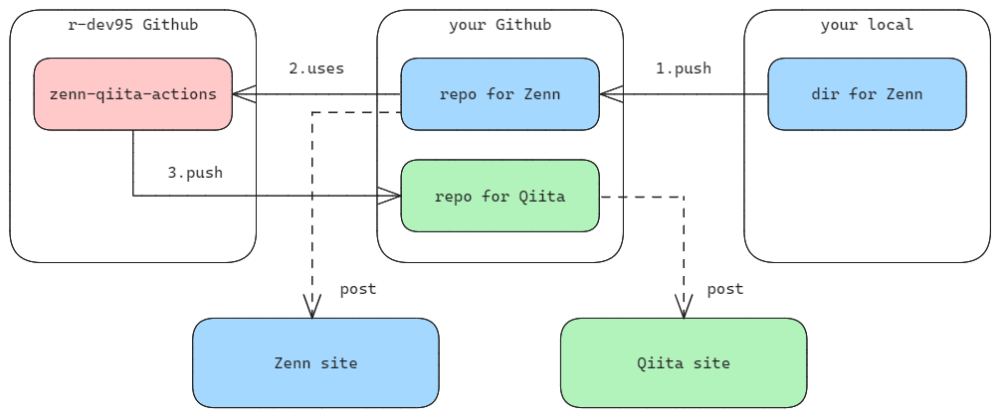

<!-- ============================================================
  Project Image
 ============================================================ -->
<div align=center>
  
  &nbsp;&nbsp;&nbsp;&nbsp;&nbsp;
  
  &nbsp;&nbsp;&nbsp;&nbsp;&nbsp;
  
  
</div>

<!-- ============================================================
  Overview
 ============================================================ -->

# :book: Overview

[](./README.md)
[](./LICENSE)
[](https://zenn.dev/)
[](https://qiita.com/)

[](https://github.com/nodejs/node)
[](https://github.com/microsoft/TypeScript)

このリポジトリは、**ZennとQiitaの記事を相互に同期するためのGitHub Actions**を提供します。

Zennで書いた記事をQiitaへ、あるいはQiitaで書いた記事をZennへ、リポジトリにプッシュするだけで自動的に変換・投稿（コミット＆プッシュ）できます。これにより、両プラットフォームでの記事管理の手間を大幅に削減します。

<!-- ============================================================
  Features
 ============================================================ -->

## :desktop_computer: Features

- **差分検知:** `git diff` を利用し、変更があったファイル（追加・更新・削除）のみを同期対象とします。
- **双方向のフォーマット変換:** ZennとQiita、双方向でマークダウンのメタデータとコンテンツを自動変換します。
- **ファイルの自動削除:** 同期元で記事を削除すると、同期先の記事も自動で削除されます。
- **自動コミット＆プッシュ:** 変換後のファイルを指定のリポジトリへ自動でコミット＆プッシュします。
- **柔軟な設定:** コンフィグファイルにより、一部の動作をカスタマイズ可能です。

<!-- ============================================================
  Getting Started
 ============================================================ -->

## :rocket: Getting Started

<div align=center>
  
</div>

このアクションを利用することで、ZennとQiitaのどちらか一方のリポジトリを更新するだけで、もう一方にも内容が自動で反映されるようになります。

セットアップは、以下の3つのステップで完了します。
ここでは `Zenn -> Qiita` の同期を例に説明します。（逆方向も同様に設定可能です）

1. **事前準備:** ZennとQiitaの記事を管理するリポジトリをそれぞれ準備します。
1. **GitHub Apps の設定:** 同期先リポジトリへの書き込み権限を持つGitHub Appを作成します。
1. **GitHub Actions の設定:** 同期元リポジトリにワークフローファイルを作成し、同期処理を定義します。

## :wrench: Setup

### 1. 事前準備

まず、ZennとQiitaそれぞれの記事を管理するためのリポジトリをGitHub上に作成します。

- **Zenn用リポジトリ:**
  - [Zenn CLIをインストール](https://zenn.dev/zenn/articles/install-zenn-cli)し、リポジトリをセットアップします。
  - [GitHubリポジトリと連携](https://zenn.dev/zenn/articles/connect-to-github)させ、プッシュで記事が投稿される状態にしておきます。
- **Qiita用リポジトリ:**
  - [Qiita CLIをインストール](https://github.com/increments/qiita-cli)し、リポジトリをセットアップします。
  - `public`ディレクトリが常に存在するように、`.keep`などの空ファイルを置いておくことを推奨します。

### 2. GitHub Apps の設定

同期先リポジトリ（例: Qiita用リポジトリ）にファイルを書き込むための権限を持つGitHub Appを作成します。

1. **GitHub Appsの新規作成:**
    - `Settings` -> `Developer Settings` -> `Github Apps` -> `New Github App` を選択します。
    - `Github App name`（任意、グローバルで一意）と `Homepage URL`（例: `https://example.com`）を入力します。
    - `Webhook` の `Active` のチェックを外します。
1. **権限の設定:**
    - `Permissions` -> `Repository permissions` -> `Contents` に `Read and write` を設定します。
1. **プライベートキーの発行:**
    - 作成したAppのページで `Private keys` -> `Generate a private key` を選択し、キーファイル（`.pem`）をダウンロードします。
1. **Appのインストール:**
    - 左メニューの `Install App` から、同期先のリポジトリ（例: Qiita用リポジトリ）を選択してインストールします。
1. **Secretsの登録:**
    - **同期元リポジトリ**（例: Zenn用リポジトリ）の `Settings` -> `Secrets and variables` -> `Actions` に移動します。
    - `New repository secret` を選択し、以下の2つを登録します。
      - `APP_ID`: 作成したGitHub Appの `App ID`
      - `PRIVATE_KEY`: ダウンロードしたプライベートキーファイルの中身（テキスト）

### 3. GitHub Actions の設定

同期元リポジトリ（例: Zenn用リポジトリ）に、同期を実行するためのワークフローファイルを作成します。

`.github/workflows/sync-articles.yml` のような名前でファイルを作成し、以下の内容を貼り付けてください。
その後、`< >`で囲まれた部分をご自身の環境に合わせて修正してください。

```yaml
name: Sync Zenn to Qiita

on:
  push:
    branches:
      - main
    paths:
      - 'articles/**.md' # Zennの記事ファイルが変更された時のみ実行

jobs:
  sync-zenn-qiita-articles:
    # 自分のアカウントからのプッシュでのみ実行（Botによる無限ループを防止）
    if: github.actor == '<your-github-user-name>'
    runs-on: ubuntu-latest
    steps:
      # 1. GitHub Appsからトークンを生成
      - name: Generate GitHub Apps token
        id: generate
        uses: actions/create-github-app-token@v1
        with:
          app-id: ${{ secrets.APP_ID }}
          private-key: ${{ secrets.PRIVATE_KEY }}

      # 2. 同期元（Zenn）リポジトリをチェックアウト
      # git diff を使うため fetch-depth: 0 を指定
      - name: Checkout Zenn repository
        uses: actions/checkout@v4
        with:
          path: <your-zenn-repo-name>
          fetch-depth: 0

      # 3. 同期先（Qiita）リポジトリをチェックアウト
      # 書き込み用に生成したトークンを使用
      - name: Checkout Qiita repository
        uses: actions/checkout@v4
        with:
          repository: <your-github-user-name>/<your-qiita-repo-name>
          path: <your-qiita-repo-name>
          ref: ${{ github.ref }}
          token: ${{ steps.generate.outputs.token }}
          persist-credentials: false

      # 4. 記事の同期アクションを実行
      - name: Run sync-zenn-qiita-articles
        uses: r-dev95/sync-zenn-qiita-articles@main
        with:
          zenn-repo-name: <your-zenn-repo-name>
          qiita-repo-name: <your-qiita-repo-name>
          sync-to-repo-name: <your-qiita-repo-name> # ZennからQiitaへ同期
          git-token: ${{ steps.generate.outputs.token }}
          # commit-msg: <your-commmit-message> # オプション
          # config-path: <your-zenn-repo-name>/sync-config.json # オプション
```

#### アクションの入力（`with`）

`sync-zenn-qiita-articles`アクションで使用する引数です。

| 引数名 | 必須 | 説明 | デフォルト値 |
| :--- | :---: | :--- | :--- |
| `zenn-repo-name` | 〇 | Zenn用のリポジトリ名 | - |
| `qiita-repo-name` | 〇 | Qiita用のリポジトリ名 | - |
| `sync-to-repo-name` | 〇 | 同期先のリポジトリ名（`zenn-repo-name`または`qiita-repo-name`） | - |
| `git-token` | 〇 | 同期先への書き込み権限を持つトークン | - |
| `commit-msg` | - | 同期先へのコミットメッセージ | `Auto Commit.` |
| `config-path` | - | カスタム設定ファイルのパス | `sync-zenn-qiita-articles/dist/sync-config.json` |

## :gear: Configuration

オプションで、リポジトリのルートなどに`json`形式のコンフィグファイル（例: `sync-config.json`）を置くことで、変換の挙動をカスタマイズできます。
作成した場合は、ワークフローファイルの`config-path`引数でパスを指定してください。

```json
{
  "deleteOn": false,
  "imageFormat": "normal",
  "dstImageBaseUrl": ""
}
```

| キー | 型 | 説明 |
| :--- | :--- | :--- |
| `deleteOn` | `boolean` | `true`の場合、同期元で記事を削除すると同期先の記事も削除します。 |
| `imageFormat` | `"normal"` or `"tag"` | `Zenn -> Qiita`変換時の画像形式。`normal`はMarkdown記法、`tag`は``タグに変換します。 |
| `dstImageBaseUrl` | `string` | `Zenn -> Qiita`変換時に、`/images/`から始まる画像パスのベースURLを指定します。 |

## :repeat: Conversion Details

このアクションは、ZennとQiitaのMarkdown記法の違いを吸収するための変換処理を行います。

- **メタデータ:** `title`, `tags`/`topics`, `published`/`private` などを相互に変換します。
- **コンテンツ:**
  - コードブロックの差分表示 (`diff`)
  - 画像のキャプションやサイズ指定
  - カスタムブロック (`:::message` / `:::note`)
  - アコーディオン (`:::details` / `<details>`)
  - 埋め込みリンク

各記法の詳しい変換仕様については、以下のドキュメントを参照してください。

- **[ZennとQiitaの記法と変換仕様](./docs/conversion_specifications.md)**

## :key: License

本リポジトリは、[MIT License](LICENSE)に基づいてライセンスされています。

[Zenn][Zenn] および [Qiita][Qiita] のメディアキットを README にて使用させていただいております。

[Zenn]: (https://zenn.dev/mediakit)
[Qiita]: (https://help.qiita.com/ja/articles/others-brand-guideline)
